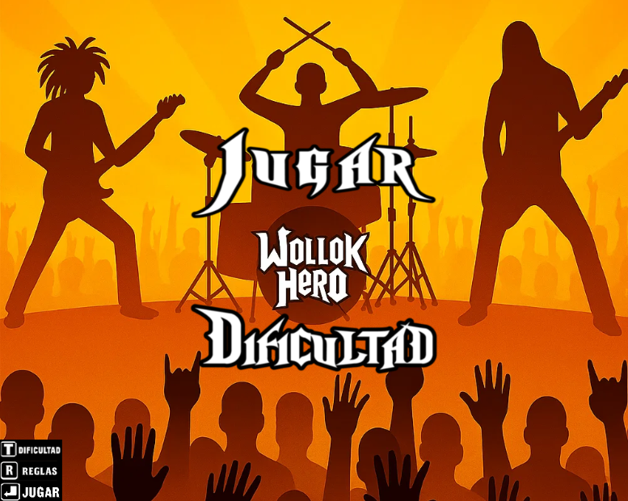
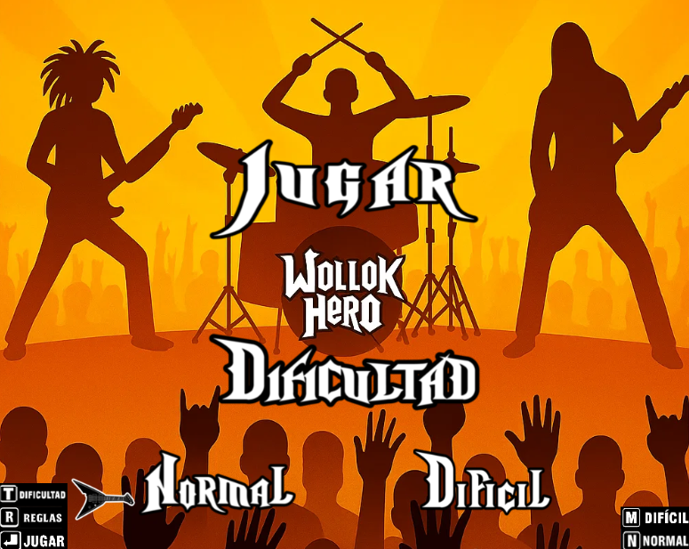

# Wollok Hero

## Equipo de desarrollo

- Joaquín Cacciatore (header)
- Alan Agustín Gonzales
- Damián Haberkorn
- Agustín Frecha
- Gastón Belardes
- Jonathan Giacomini

## Capturas

## Reglas de Juego / Instrucciones

Bienvenido a Wollok Hero
Teclas de juego:

A: Botón verde
S: Botón rojo
D: Botón amarillo
F: Botón azul
Space: Volver al menu 
Dinámica del juego:

Las notas caerán desde la parte superior de la pantalla. Tu objetivo es presionar la tecla correspondiente al color de la nota justo cuando esta se encuentre cerca del botón de su mismo color en la parte inferior.

Puntuación y combos:

Cada vez que aciertes una nota, se sumarán puntos a tu marcador. Si logras 4 aciertos consecutivos, cada hit adicional valdrá 2 puntos. Si alcanzas 8 aciertos consecutivos, cada acierto valdrá 3 puntos.  Si fallas una nota, el contador de hits se reiniciará y perderás tu potenciador.

Vidas y fin de la partida:

Comienzas el juego con 3 vidas, Perderás una vida cada vez que acumules 6 fallos. Si pierdes las 3 vidas, terminaras la cancion con un Game Over.

Condición de victoria:

Ganarás la partida si terminas la cancion antes de perder todas tus vidas y habras ROCKEADO

## Otros

- Tecnicatura en Programación / Programación con Objetos 1 - Comisión 4 / Unahur
- Versión de wollok
- Una vez terminado, no tenemos problemas en que el repositorio sea público
